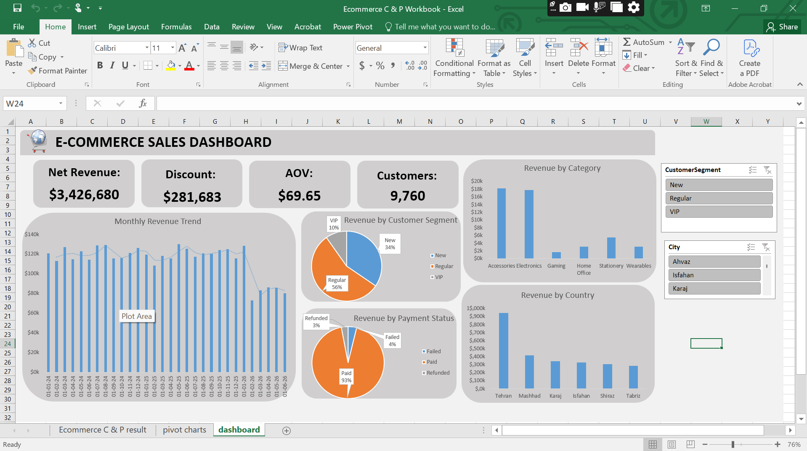

E-Commerce Performance & Strategic Profitability Analysis
> **End-to-end e-commerce analytics project using SQL Server and Microsoft Excel to evaluate sales performance, revenue, profitability, customer behavior, regional performance, and payment reliability.**
Author: Adeniji Abdullateef Ademola  
Role: Data Analyst | Statistics  
Project Date: September 2026
---
📌 Project Overview
This project presents an end-to-end analysis of an e-commerce transaction dataset containing 10,000+ customers and multiple interconnected business entities.
The objective was to transform raw transactional data into a structured analytical dataset, identify meaningful business patterns, and translate those findings into practical recommendations for improving revenue efficiency, customer value, product performance, and regional growth.
The project combines:
SQL Server / T-SQL for relational data modeling, querying, transformation, and analytical views
Microsoft Excel for data cleaning, aggregation, Pivot Tables, and interactive dashboard development
Power Query for data preparation and transformation
Notion for project planning and workflow tracking
The analysis focuses on four major business areas:
Product and sales performance
Regional revenue performance
Payment gateway reliability
Customer segmentation and retention
---
🎯 Business Problem
An e-commerce business may generate substantial revenue while still having opportunities to improve the efficiency and quality of that revenue.
The business therefore needs answers to questions such as:
Which product categories contribute most to sales volume?
Which products or categories present cross-selling opportunities?
How is revenue distributed across regions?
Why does one region outperform others?
How reliable are the available payment methods?
What does the customer base look like across loyalty segments?
How can the business increase customer lifetime value?
Where can promotional or advertising resources be better allocated?
What actions could increase Average Order Value (AOV) and recurring revenue?
The purpose of this project was to answer these questions using a repeatable, data-driven workflow.
---
📊 Executive Summary
The analysis indicates that the e-commerce platform has a strong transactional foundation, supported by substantial revenue, a broad customer base, and highly reliable payment processing.
At the same time, the analysis identified several opportunities for additional growth:
Sales volume is concentrated in a small number of product categories.
Revenue is geographically concentrated, with Tehran generating nearly $1M, substantially ahead of other regions.
Payment failures remain below 1%, indicating high transaction reliability.
The customer base is concentrated in Regular and New customer segments, while the VIP segment represents a smaller proportion of customers.
These patterns create opportunities for complementary product bundling, regional experimentation, and loyalty-program optimization.
---
📈 KPI Scorecard
KPI	Result
Total Net Revenue	$3.4M
Total Customers	10,000+
Average Order Value (AOV)	~$70
Total Discount Volume	>$300,000
Payment Failure Rate	<1%
> **Note:** KPI values are based on the analytical outputs generated during this project. Definitions and calculations are implemented within the SQL analysis and Excel reporting workflow.
---
🏗️ Data Architecture
The project uses a relational structure consisting of four primary entities:
```text
                    ┌───────────────┐
                    │   Customers   │
                    └───────┬───────┘
                            │
                            │ Customer ID
                            ▼
┌───────────────┐     ┌───────────────┐
│   Products    │────▶│     Orders    │
└───────────────┘     └───────┬───────┘
                              │
                              │ Order ID
                              ▼
                       ┌───────────────┐
                       │   Payments    │
                       └───────────────┘
```
Core entities
Customers
Customer-level information
Customer identifiers
Geographic/customer attributes used for segmentation
Orders
Transaction-level records
Order dates
Product references
Quantities
Discounts
Order values
Products
Product information
Product categories
Product attributes used for performance analysis
Payments
Payment transactions
Payment methods
Payment outcomes/statuses
Transaction reliability metrics
The relational structure allows the analysis to connect customer, product, order, and payment information into a unified analytical view.
---
🔄 End-to-End Analytical Workflow
The project followed a structured data analytics lifecycle:
```text
Raw CSV Files
      ↓
SQL Server Database
      ↓
Data Validation & Exploration
      ↓
Table Relationships & JOINs
      ↓
Calculated Metrics
      ↓
SQL Views / Analytical Dataset
      ↓
Excel + Power Query
      ↓
Pivot Tables & Aggregations
      ↓
Interactive Dashboard
      ↓
Business Insights
      ↓
Strategic Recommendations
```
---
1. 🗄️ Data Loading & Relational Database Design
The raw data was provided as CSV files and organized into four core tables:
`Customers`
`Orders`
`Payments`
`Products`
The datasets were imported into SQL Server to create a relational environment suitable for structured analysis.
The database design made it possible to connect transactions to:
individual customers
products
payment transactions
customer locations
product categories
order-level financial information
This approach reduced the need to analyze isolated spreadsheets and allowed the project to use relational SQL techniques throughout the workflow.
---
2. 🔍 Data Exploration & Validation
Before performing business analysis, the data was explored to understand its structure and identify potential data-quality issues.
The exploratory process included:
Reviewing table structures
Checking record counts
Examining available columns
Understanding primary and foreign-key relationships
Inspecting null/missing values
Reviewing duplicate or repeated records where relevant
Checking data types
Validating date fields
Examining categorical values
Checking numerical fields used in revenue calculations
This stage was important because analytical results are only as reliable as the underlying data.
---
3. 🔗 Data Modeling & SQL Analysis
SQL Server was used as the primary analytical engine.
The SQL workflow included multi-table `JOIN` operations to combine the four core entities.
For example, order information could be connected to customer information through customer identifiers, while product and payment information could be connected through the relevant transaction keys.
SQL techniques used
The project demonstrates practical use of:
`SELECT`
`WHERE`
`GROUP BY`
`ORDER BY`
Aggregate functions such as `SUM()`, `COUNT()`, and `AVG()`
`JOIN`
Conditional logic
Date functions
Calculated fields
Common analytical filtering techniques
SQL `VIEW` creation
The objective was not simply to retrieve records, but to create business-ready datasets that could support downstream reporting.
---
4. 🧮 Feature Engineering & KPI Calculations
Several analytical metrics were derived from the transactional data.
Net Revenue
The analysis calculates realized revenue at the order level using the relevant order-value and discount fields.
Conceptually:
```text
Net Revenue = Gross Order Value - Discount Amount
```
Discount Amount
Discount-related fields were transformed into order-level discount metrics to understand how much value was given away through promotions.
Average Order Value
AOV was used to measure the average value generated per order.
Conceptually:
```text
AOV = Total Net Revenue / Number of Orders
```
Payment Failure Rate
Payment reliability was evaluated by comparing unsuccessful payment transactions with total payment transactions.
Conceptually:
```text
Payment Failure Rate =
Failed Transactions / Total Transactions × 100
```
These calculations allowed the analysis to move beyond raw transaction counts and evaluate business performance through standardized KPIs.
---
5. 👁️ SQL Views & Data Governance
Where appropriate, complex analytical logic was encapsulated into SQL `VIEW` objects.
This provides a reusable layer between raw transactional tables and reporting outputs.
The approach helps:
Centralize business logic
Reduce repeated SQL code
Improve consistency across analyses
Make complex transformations easier to reuse
Provide reporting-ready datasets for downstream analysis
The views act as an analytical layer that can be queried without repeatedly rebuilding the underlying multi-table logic.
---
6. 📊 Excel Analytics & Dashboard Development
After the SQL analysis and transformation stage, the modeled data was brought into Microsoft Excel for further analysis and visualization.
Excel tools used
Power Query
Pivot Tables
Pivot-based analysis
Interactive charts
KPI reporting
Filtering and segmentation
Power Query was used where necessary to prepare and standardize data before reporting.
Pivot Tables were then used to aggregate metrics across dimensions such as:
Product category
Region
Customer segment
Payment method
Transaction status
The final dashboard was designed to make important business patterns easier to identify without requiring the stakeholder to inspect raw transaction records.
---
📷 Dashboard Preview
The repository contains screenshots of the completed dashboard.
Add the dashboard image to the repository and update the filename below if necessary:
```markdown

```
The dashboard is intended to provide a high-level view of:
Revenue performance
Customer activity
Order value
Product performance
Regional revenue
Customer segmentation
Payment reliability
---
💡 Key Business Insights
1. Product Performance & Cross-Selling Opportunities
Finding
Product performance is highly concentrated.
Two product categories account for a substantial share of the observed sales volume, approaching 20,000 units, while several other categories remain below the 10,000 level.
This indicates that demand is not distributed evenly across the product portfolio.
Business implication
The strongest-performing categories can potentially be used as entry points for increasing sales of complementary products.
Recommended action
Implement complementary product bundling.
For example:
Pair gaming controllers with gaming consoles
Recommend software or accessories alongside hardware
Display complementary products during checkout
Create category-specific bundles
Use browsing and purchasing behavior to personalize recommendations
This strategy could increase the number of items purchased per transaction and potentially improve AOV.
Additional opportunity
Marketing campaigns can also be evaluated based on product margin rather than sales volume alone.
---
2. 🌍 Regional Revenue Disparities
Finding
Revenue is geographically concentrated.
Tehran generates nearly $1M in revenue, while Mashhad, the secondary market identified in the analysis, generates approximately half that amount.
Other regions contribute progressively smaller amounts.
Business implication
The performance gap suggests that customer demand, product mix, promotional activity, market size, or other regional factors may differ significantly.
However, the analysis identifies the disparity rather than claiming a single causal explanation.
Recommended action
Use controlled regional experimentation.
A potential approach would be:
Identify the highest-performing products in Tehran.
Examine their sales contribution and customer segments.
Compare promotional activity and discount behavior.
Select one lower-performing region as a pilot market.
Test targeted promotional campaigns.
Measure incremental revenue and profitability.
Compare the result against a suitable baseline before scaling.
This creates a more evidence-based approach to regional expansion rather than simply increasing spending across every underperforming market.
---
3. 💳 Payment Gateway Reliability
Finding
The analysis shows that the overall payment failure rate remains below 1% across the available payment methods.
This indicates a relatively stable payment transaction environment within the analyzed dataset.
Business implication
Payment infrastructure does not appear to be a major source of transaction friction based on the observed failure rate.
Recommended action
Maintain the existing monitoring process.
The business should continue tracking:
Payment failure rate
Failure rate by payment method
Failure rate over time
Abnormal spikes
Repeated customer payment failures
A low overall failure rate should still be monitored because small changes at scale can represent a meaningful number of affected transactions.
---
4. 👥 Customer Segmentation & Retention
Finding
The customer base is concentrated primarily in the Regular and New customer segments.
The VIP segment represents a smaller proportion of the customer base.
Business implication
The distribution suggests an opportunity to increase customer progression from:
```text
New → Regular → VIP
```
The goal is not simply to increase the number of VIP customers, but to increase customer value and retention through sustainable engagement.
Recommended action
Develop a structured loyalty strategy.
Potential initiatives include:
Clearly defined VIP spending thresholds
Loyalty rewards
Personalized offers
Exclusive products or bundles
Repeat-purchase incentives
Early access to selected products
Customer-specific recommendations
The business can also analyze which behaviors distinguish VIP customers from Regular customers and use those patterns to design targeted retention campaigns.
---
📌 Strategic Recommendation Framework
Based on the analysis, the opportunities can be organized into four strategic areas:
Business Area	Observed Pattern	Potential Action
Product Portfolio	Sales concentrated in a few categories	Use bundling and cross-selling
Regional Performance	Tehran significantly outperforms other regions	Test successful product/promotional patterns in secondary markets
Payments	Failure rate below 1%	Maintain monitoring and anomaly detection
Customer Value	Regular/New segments dominate	Strengthen loyalty progression and retention
---
🧠 Analytical Interpretation
One of the key lessons from this project is that revenue alone does not provide a complete picture of business performance.
A stronger analysis considers several dimensions simultaneously:
```text
Revenue
   +
Orders
   +
Customer Behavior
   +
Product Mix
   +
Discounts
   +
Geography
   +
Payment Reliability
   =
Business Performance
```
For example, a high-sales product may not necessarily be the most attractive product for every strategic objective. Similarly, a high-revenue region may have characteristics that cannot automatically be replicated elsewhere.
The analysis therefore focuses on identifying patterns and opportunities that can be investigated and tested, rather than treating correlation as proof of causation.
---
🛠️ Technology Stack
SQL Server
Used for:
Database creation
Relational data modeling
Data exploration
Multi-table joins
Aggregations
Feature engineering
KPI calculations
Analytical views
Microsoft Excel
Used for:
Data preparation
Pivot Tables
Aggregation
KPI reporting
Interactive dashboard development
Business visualization
Power Query
Used for:
Data transformation
Data standardization
Preparing data for analysis
Notion
Used for:
Project planning
Task tracking
Workflow organization
Monitoring project milestones
---
📁 Repository Structure
The repository contains the datasets, SQL scripts, Excel workbook, documentation, and dashboard screenshots used throughout the project.
```text
ecommerce-sales-profitability-analysis/
│
├── Ecommerce C & P Workbook.xlsx
├── Ecommerce project SQL code.txt
├── SQLQuery2.sql
├── README.md
│
├── customers.csv
├── orders.csv
├── payments.csv
├── products.csv
│
├── Screenshot 2026-09-14 175736.png
└── Screenshot 2026-09-14 175816.png
```
File descriptions
File	Purpose
`customers.csv`	Customer-level dataset
`orders.csv`	Order and transaction-level data
`payments.csv`	Payment transaction information
`products.csv`	Product and category information
`SQLQuery2.sql`	SQL Server analysis/query script
`Ecommerce project SQL code.txt`	Additional SQL code used during the project
`Ecommerce C & P Workbook.xlsx`	Excel analysis and dashboard workbook
`Screenshot ...png`	Dashboard/analysis screenshots
`README.md`	Project documentation
> If the repository folders are reorganized later, update this section so the documentation continues to match the actual repository structure.
---
🔬 Analytical Questions Explored
The project was structured around practical business questions rather than simply producing charts.
Product
Which categories generate the most sales?
Which categories underperform?
Where are cross-selling opportunities?
Can complementary products increase basket size?
Geography
Which regions generate the most revenue?
How large is the performance gap between leading and secondary markets?
Which products and customer groups contribute to regional differences?
Customers
How are customers distributed across segments?
How large is the VIP customer base?
What opportunities exist to improve retention and customer lifetime value?
Payments
What percentage of transactions fail?
How reliable are different payment methods?
Are there noticeable payment performance anomalies?
Revenue
What is total net revenue?
What is the average order value?
How much revenue is affected by discounts?
Where are the largest opportunities for revenue improvement?
---
📋 Data-to-Decision Framework
The project follows a simple analytical principle:
```text
DATA
 ↓
QUESTION
 ↓
ANALYSIS
 ↓
INSIGHT
 ↓
BUSINESS IMPLICATION
 ↓
RECOMMENDATION
 ↓
MEASUREMENT
```
For example:
```text
Regional Data
      ↓
Tehran generates substantially more revenue
      ↓
Identify products/customer patterns behind the difference
      ↓
Design a regional pilot
      ↓
Measure incremental revenue/profit
      ↓
Scale only if results support expansion
```
This approach keeps the analysis connected to measurable business outcomes.
---
⚠️ Limitations & Considerations
The findings should be interpreted within the scope of the available dataset.
1. Correlation vs. causation
Observed relationships do not automatically establish causal relationships.
For example, Tehran's higher revenue does not by itself prove that a particular product, advertising strategy, or customer characteristic caused the difference.
2. Regional differences
Regional performance may be affected by factors that are not represented in the dataset, such as:
Population
Local purchasing power
Competition
Logistics
Marketing exposure
Product availability
3. Customer segmentation
Customer segments provide a useful framework for analysis, but additional behavioral and profitability metrics could strengthen the segmentation model.
4. Profitability depth
The analysis focuses strongly on revenue and transactional performance. A more complete profitability model could incorporate additional cost information such as:
Cost of goods sold
Shipping costs
Returns
Marketing spend
Operational costs
Payment processing fees
This would allow future analysis to move from revenue optimization toward a more comprehensive contribution-margin analysis.
---
🚀 Future Improvements
Several extensions could make the project more advanced.
1. Customer Lifetime Value Model
Develop a quantitative CLV model using:
Purchase frequency
Average order value
Customer tenure
Repeat purchase behavior
Retention rate
2. Cohort Analysis
Analyze customers based on acquisition month or first-purchase period to understand:
Retention
Repeat purchasing
Revenue contribution over time
3. Product Affinity Analysis
Use transaction-level purchasing behavior to identify products that are frequently purchased together.
This could support a more data-driven recommendation engine.
4. Regional Profitability
Extend regional analysis from revenue to contribution margin by incorporating:
Marketing spend
Shipping costs
Discounts
Returns
Product costs
5. Advanced Customer Segmentation
Develop behavioral segments using:
Recency
Frequency
Monetary value
This could produce an RFM-based customer segmentation framework.
6. Automated BI Reporting
A future version could connect the SQL data model directly to a BI platform such as Power BI, reducing manual export steps and enabling automated refreshes.
---
📈 Business Impact Opportunities
If implemented and properly tested, the recommendations could support several business objectives:
Increase Average Order Value
Through:
Bundling
Cross-selling
Product recommendations
Checkout offers
Improve Regional Growth
Through:
Targeted regional campaigns
Controlled A/B testing
Product-market analysis
Replication of successful patterns
Increase Customer Lifetime Value
Through:
Loyalty programs
Personalized offers
Retention campaigns
VIP progression
Protect Transaction Reliability
Through:
Continuous payment monitoring
Failure-rate tracking
Payment-method analysis
Anomaly detection
---
💼 What This Project Demonstrates
This project demonstrates practical experience across multiple stages of the analytics lifecycle:
Relational data modeling
SQL querying
Multi-table data integration
Data transformation
Feature engineering
KPI development
Exploratory data analysis
Customer segmentation
Regional analysis
Product performance analysis
Business intelligence reporting
Dashboard development
Business recommendation development
More importantly, the project demonstrates the ability to move from:
> **Raw data → structured analysis → business insight → actionable recommendation**
rather than treating data analysis as purely a visualization exercise.
---
📚 Project Deliverables
The repository contains the main working materials used to complete the project:
Raw CSV datasets
SQL Server scripts
SQL analytical queries
Excel workbook
Interactive dashboard
Dashboard screenshots
Project documentation
All analysis was developed from the project datasets and the documented analytical workflow.
---
👤 About the Analyst
Adeniji Abdullateef Ademola
Data Analyst | Statistics
This project was completed as part of my continued development in data analytics, with a focus on using SQL and Excel to solve practical business problems.
My approach to analytics emphasizes:
Asking meaningful business questions
Building reliable data workflows
Using appropriate analytical methods
Communicating findings clearly
Translating insights into measurable business actions
---
⭐ Project Takeaway
The central takeaway from this analysis is that strong headline revenue does not eliminate the need for optimization.
The dataset reveals several areas where an e-commerce business can investigate additional growth:
Product performance → Cross-selling
Regional differences → Targeted experimentation
Payment reliability → Continuous monitoring
Customer segmentation → Loyalty and retention
The next step after identifying these opportunities is to test the recommendations, measure their financial impact, and iterate based on the results.
---
📌 Disclaimer
This repository is intended for portfolio and educational purposes. The strategic recommendations represent analytical opportunities identified from the available dataset and should be validated against additional operational, financial, and market information before implementation.
